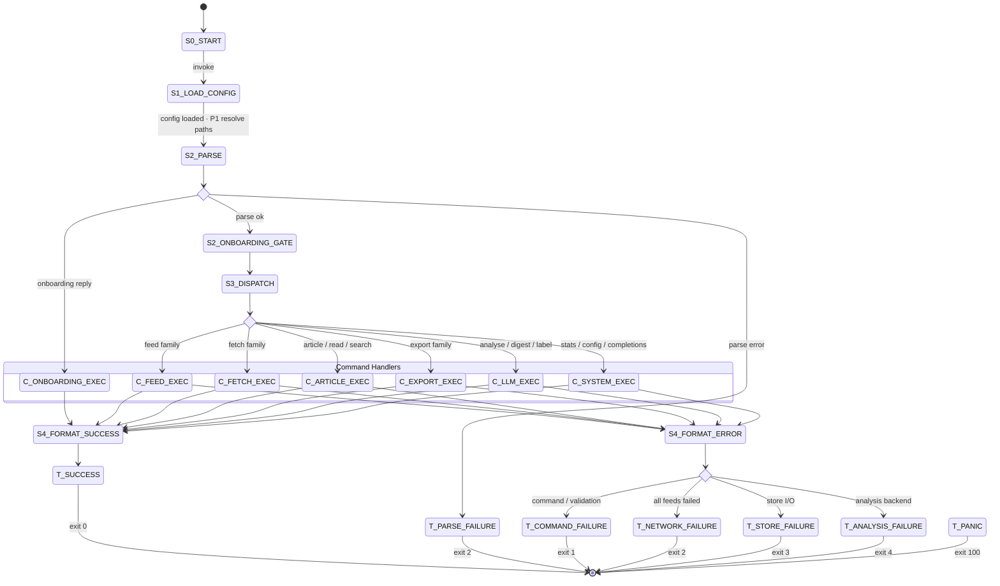

# RSS Skill


A markdown-native RSS client for agentic coding harnesses. Accepts CLI-like commands or natural-language equivalents and executes them through documented runtime primitives. No compiled binary, no external RSS tool.

Licensed under the [Apache License 2.0](../LICENSE).

```text
rss --json feed ls
rss read --unread --limit 20
rss export json --output out.json
```
or 
```text
rss Show me my unread articles.
```

> **Invocation syntax is harness-specific.** The examples above use bare `rss` as the canonical command. Your harness prefixes it with its own skill invocation token:
>
> | Harness | Syntax |
> |:--|:--|
> | Claude Code | `/rss <command>` |
> | Codex | `$rss <command>` |
> | Other | Consult your harness's skill/plugin documentation |

## Command Families

| Family | Commands |
|:--|:--|
| Feed management | `feed add`, `feed rm`, `feed ls`, `feed import`, `feed tag` |
| Fetching | `fetch` |
| Reading | `read`, `ls`, `article`, `show`, `mark`, `search` |
| Export | `export opml\|json\|md` |
| Analysis | `analyse`, `digest`, `label` |
| System | `stats`, `config show`, `completions` |

Full grammar, flags, and precedence rules: [`RUNTIME/COMMAND_GRAMMAR.md`](RUNTIME/COMMAND_GRAMMAR.md)

## Prerequisites

The skill's execution primitives depend on:

| Dependency | Used by | Notes |
|:--|:--|:--|
| `python3` | Feed parsing, store mutations, reference resolution | stdlib only — no pip packages |
| `curl` | HTTP fetch | Conditional headers for caching |
| `jq` | Store load/save, article filtering | JSON processing |

The agentic harness itself (Claude Code, Codex, etc.) must support shell execution, file I/O, and network access.

## How It Works



Full state machine specification: [`RUNTIME/STATE_MACHINE.md`](RUNTIME/STATE_MACHINE.md)

### Execution Pipeline

1. Load config and resolve effective defaults (built-in → config file → env vars → flags).
2. Parse the command string, normalise aliases, validate constraints.
3. Run the first-run onboarding gate if no prior state exists.
4. Dispatch to the appropriate command family.
5. Execute primitives: store load/save, network fetch/parse, analysis, output formatting.
6. Emit a success or error envelope with a mapped exit code.

### Runtime Specifications

| Concern | Spec file |
|:--|:--|
| State machine | [`RUNTIME/STATE_MACHINE.md`](RUNTIME/STATE_MACHINE.md) |
| Execution primitives | [`RUNTIME/EXECUTION_PRIMITIVES.md`](RUNTIME/EXECUTION_PRIMITIVES.md) |
| Command grammar | [`RUNTIME/COMMAND_GRAMMAR.md`](RUNTIME/COMMAND_GRAMMAR.md) |
| Runtime context schema | [`RUNTIME/RUNTIME_CONTEXT.md`](RUNTIME/RUNTIME_CONTEXT.md) |
| Error mapping | [`RUNTIME/ERRORS.md`](RUNTIME/ERRORS.md) |
| Exit codes | [`RUNTIME/EXIT_CODES.md`](RUNTIME/EXIT_CODES.md) |

## Configuration

### Environment Variables

| Variable | Default | Description |
|:--|:--|:--|
| `RSS_DB` | Platform data directory | Store file path; overridden by `--db` flag |
| `RSS_CONCURRENCY` | `10` | Max concurrent feed fetches; overridden by `--concurrency` flag |
| `RSS_OUTPUT` | `human` | Output mode (`json` or `human`); overridden by `--json` flag or non-TTY detection |
| `RSS_MAX_ARTICLE_CHARS` | `2000` | Max characters per article in LLM analysis context |
| `RSS_ANALYSIS_SPECS_DIR` | `<skill_root>/ANALYSIS_SPECS` | Override directory for analysis task specs |
| `RSS_LLM_BACKEND` | `agent` | Local analysis backend selector |

### Config File

Optional. Located at `$XDG_CONFIG_HOME/rss/config.toml` (or platform equivalent). Missing config is non-fatal — the runtime continues with defaults.

### Precedence

Built-in defaults → config file → environment variables → command flags.

## First Run

Missing config and missing store are valid states. The runtime continues with defaults, bootstraps the store path, and initialises empty state in memory. On first run, the skill offers an optional onboarding sequence:

1. `config show` — see what's configured
2. `feed add <url> [-n name]` — subscribe to a feed
3. `read --unread --limit 20` — read what's new

## Output Contract

JSON mode returns a consistent envelope:

```json
{
  "ok": true,
  "command": "read",
  "data": {},
  "error": null,
  "meta": { "count": 0, "elapsedMs": 0 }
}
```

Human mode renders readable text and tables with equivalent content. Output mode is resolved by precedence: `--json` flag → non-TTY detection → `RSS_OUTPUT` env var → human default.

## Exit Codes

| Code | Meaning |
|--:|:--|
| 0 | Success |
| 1 | Command or runtime validation failure |
| 2 | Parse failure or network failure on all targets |
| 3 | Store read/write/lock failure |
| 4 | Analysis capability or invocation failure |
| 100 | Panic boundary |

## Skill Layout

```text
SKILL.md                  # Entry point — trigger rules and execution workflow
COMMANDS.md               # Canonical command inventory with primitive paths
README.md                 # This file
RUNTIME/
  COMMAND_GRAMMAR.md       # Command tree, flags, aliases, precedence
  STATE_MACHINE.md         # Session and command state machines
  EXECUTION_PRIMITIVES.md  # P1–P14: store, network, output, onboarding ops
  ERRORS.md                # Error classes and mappings
  EXIT_CODES.md            # Terminal states to exit code mapping
  RUNTIME_CONTEXT.md       # Runtime data model and context shape
ANALYSIS_SPECS/
  ANALYSE.md               # LLM analysis task spec prompt
  DIGEST.md                # LLM digest task spec prompt
  LABEL.md                 # LLM labelling task spec prompt
```

## Hard Rules

1. Preserve command semantics in strict mode - flags, aliases, positionals, precedence, side effects, exit codes.
2. Do not silently skip failure branches.
3. Log every mutating side effect.
4. Treat missing dependencies (network, analysis capability, permissions) as guarded failure transitions.
5. Do not invoke an external RSS binary. The harness executes the specs directly.
6. Do not claim behaviour not covered in the documented runtime contracts.
